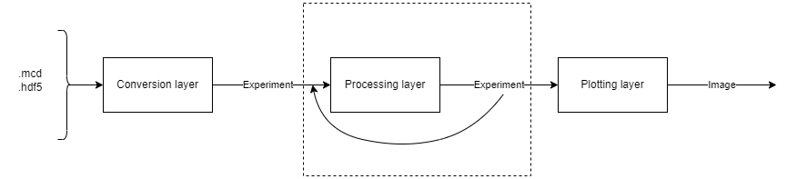

# PyCode
A simple framework in python for the analysis of MEA recordings

## Usage
To run the various tests and demo there is a powershell script *project.ps1*

``` pwsh
./project.ps1 help
```
to see the available commands

## Structure



## Install

TODO
